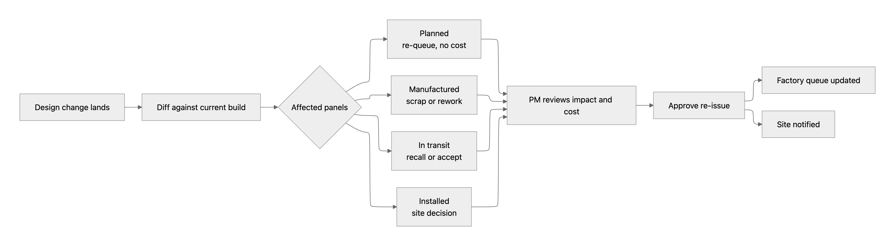
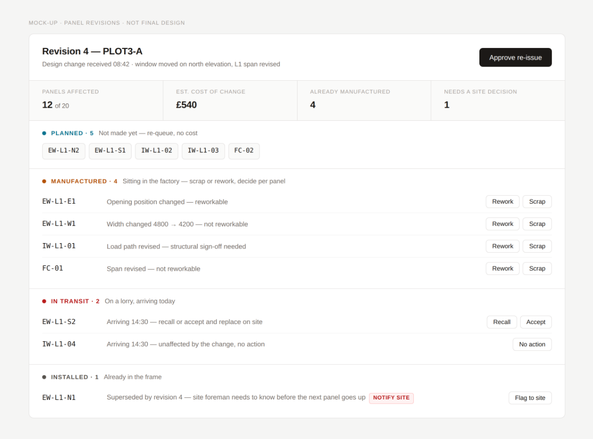
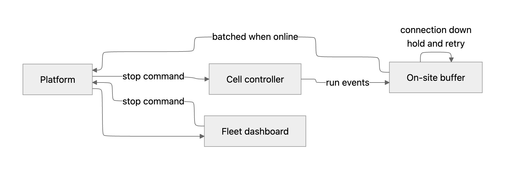
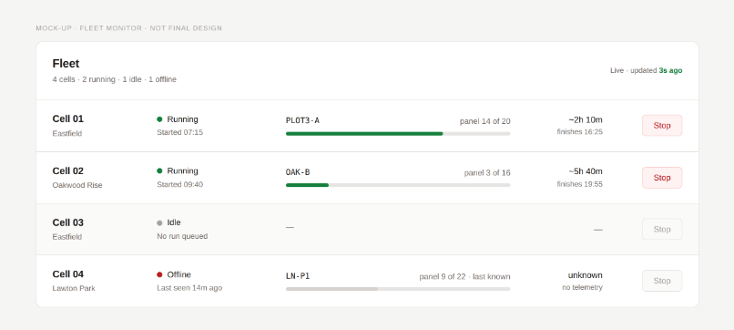

# Software Engineering Lead: Shareable Task

## The scenario
*This task simulates a day in the life of a Software Engineering Lead at AUAR: the documents you would have to read and make sense of, the decisions you would have to make, and the work you would pick up yourself.* You've just joined as Software Engineering Lead. Leadership has committed to two features in eight weeks, ending in a customer demo on a live site. You own the delivery plan across both the software team, i.e. three lead engineers, and the robotics team. Here's what product handed over and what everyone has told you. Work out what actually happens, come up with a development and delivery plan, and pick up something of value yourself to get the ball rolling.

## How this works
- **Two hours.** Your target is to present three deliverables, and you decide how to split your time between them. 
- **There is no spec.** You decide what matters, what to sequence first, and what to leave out. We will ask you to explain those calls. 
- **The hand-over is incomplete on purpose**, the way it usually is. Some of what you need is not written down anywhere. Make reasonable assumptions, write them down, and tell us what happens if one of them turns out to be wrong. 
- **Read all of it.** It was written by different people, for their own purposes, at different levels of detail. 
- **Use whatever tools you would normally use,** like, AI, documentation, libraries. We would rather see how you actually work than watch you work from memory. Just be ready to explain any decision. 
- **We ask why more than what.** Your reasoning matters more to us than the volume of what you produce.

## Deliverables

| Deliverable | Description |
| :--- | :--- |
| **Delivery plan** | Format free. What ships when, who is on what (including what you take on yourself) plus the risks you would raise now and the assumptions you had to make. |
| **One build slice** | The first piece you take on yourself. We suggest a few options below: pick one, or choose your own if you would start somewhere else. |
| **Presentation** | Walk us through the plan, the decisions behind it, your assumptions, and what you built. Format is up to you: slides, diagrams, sketches, a photo of a whiteboard, or any combination. |

*Submitting.* Send us a link to your repository and your presentation materials at least 12 hours before the interview. We will read both before we meet, so we can spend the session on the interesting questions rather than catching up.

## The brief

## Features
*You have been asked by leadership to deliver the following two features in the next 8 weeks. You do not need to know anything about timber or our MicroFactory to reason about either of these, or to argue with the estimates.* 

1. **Panel Revisions:** A design change lands mid-build. Work out which panels are affected, what's already been manufactured, what's on a lorry, what's installed: and re-issue only what's needed. 
2. **Fleet Monitor:** See every MicroFactory live from the office, and stop a run remotely. 

*“Panel Revisions” is pure software while “Fleet Monitor” needs the robotics team’s input.*

## Hand-over materials

| *#* | *Artefact* | *Format* |
| :--- | :--- | :--- |
| 1 | The ask from leadership | Slack message |
| 2 | Product brief: Panel Revisions | Notion page: value, stories, flow, mock-up |
| 3 | Product brief: Fleet Monitor | Notion page: value, stories, flow, mock-up |
| 4a–c | Three tech lead plans + technical designs | Notion page · Slack DM · Notion page + a draft .ts file |
| 5 | Robotics note | Email |
| 6 | Robotics plan + site inspection actions | Email attachment |
| 7 | Delivery backlog history | CSV + table |
| 8 | Team calendar | Table |
| 9 | Build data | Two revisions of one build + a sample event stream from a previous run |

*These arrived from different people, in different formats, at different levels of detail. Treat them as you would on your first week.*

## 1. The ask from leadership
Slack · #software-leadership · CTO · Mon 09:14 

Morning! Confirming what we agreed with the board on Friday so it's written down somewhere. Two things for the customer demo on the *12 October* : “*Panel Revisions”* and “*Fleet Monitor”*. We need to demo both working, on the live cell, running unsupervised in front of the customer. That's eight weeks from today. Robin's briefs are in Notion. 

Also please fold in the still pending actions from the site inspection earlier this month, I don't think there's much in there. Come back to me by EOD with a plan: what's landing when, who's on what, anything at risk. If something has to give, I'd rather know now than in week six.

## 2. Product brief: Panel Revisions
Notion · Robin, Product Lead · handover to engineering 

*Problem.* Designs change mid-build: a client moves a window, or an engineer revises a span. Nobody can tell quickly which panels are affected, so the production manager rebuilds the schedule by hand and, when in doubt, re-makes more than is needed. 

*Value* 
- ~12% of panels on a changed build are re-made unnecessarily. At ~£180 a panel and ~20 panels a build, that's ~£430 wasted per changed build. 
- About 1 in 3 builds sees a design change after manufacturing has started. 
- Applies to every build we run today. Value will land the week it ships. 
- Also cuts the production manager's replanning from half a day to minutes. 

*User stories*
| *#* | *As a…* | *I want…* | *So that…* | *Priority* |
| :--- | :--- | :--- | :--- | :--- |
| 1 | production manager | to see which panels a design change affects | I only re-make what's needed | Must |
| 2 | production manager | to see the status of each affected panel: planned, made, in transit, installed | I know what's still recoverable | Must |
| 3 | production manager | to approve a re-issue and have the factory queue update | the change reaches the floor | Must |
| 4 | site foreman | to be told when a panel I'm about to install has been superseded | I don't install something that's already obsolete | Must |
| 5 | production manager | to see what a change costs before I approve it | I can push back on the client | Should |

**Flow** 


*Open questions from product.* How far back can we revise once a panel is installed? Does the client need an audit trail of changes? 

**Mock-up**


## 3. Product brief: Fleet Monitor
Notion · Robin, Product Lead · handover to engineering 

*Problem.* We have one cell today, with someone standing next to it. But next year, we will have fifty cells on sites we can't drive to. Right now you can't tell what a cell is doing without phoning the operator. 

*Value* 
- Unlocks the operating model. One supervisor covering several cells instead of one person per cell. That's the gap between our current cost base and the one the plan assumes. 
- Remote stop is a prerequisite for unsupervised running, which everything else depends on. 
- It's what the customer is buying into. That’s why it’s crucial that we demo it to the client now. 
- Worth being honest: near-zero value this quarter on real production. We only have one cell, and someone is standing next to it. 

*User stories*
| *#* | *As a…* | *I want…* | *So that…* | *Priority* |
| :--- | :--- | :--- | :--- | :--- |
| 1 | ops supervisor | to see every cell and what it's running | I know where to look | Must |
| 2 | ops supervisor | to see run progress and expected finish | I can plan the day | Must |
| 3 | ops supervisor | to stop a run remotely | I can act on a problem I can see | Must |
| 4 | site operator | the cell to keep running and catch up when the connection drops | a dropout doesn't cost me a run | Must |
| 5 | ops supervisor | to see the last 24h of events for a cell | I can work out what went wrong | Should |

*Open questions from product.* What does "stop" actually mean? pause mid-panel, or finish the current panel and halt? We don't know; needs robotics to answer what’s possible so as to not put the current panel that is being made in an unrecoverable state, or the hardware at risk. 

**Flow** 



**Mock-up**   


## 4. Tech lead plans + technical designs

### 4a. Alex: geometry + solver Lead
Notion plan 

*Panel Revisions*
| *Item* | *Est* | *Confidence* |
| :--- | :--- | :--- |
| Panel diff logic: work out which panels changed between two versions of a build | 4 wks | Medium |
| Indirect effects logic: identify a panel that didn't change but is affected by one that did | 2 wks | Low |

- Low confidence on indirect effects because I don't know yet how far a change propagates. If moving one window can cascade through a whole level, this is a much bigger problem than 2 weeks and I can't estimate it until I've tried. 
- Both will need to read `PanelSpec` off the build schema. It’s a flat structure, and has been stable for a year, so I will build on top of that. I'll add a revision field to it, and keep the previous version alongside. 

**Technical design: panel diff (toggle to open)** 
Compare two revisions panel by panel. Hash the geometry, i.e. dimensions, openings, connection points, and compare hashes. Different hash, means panel changed. Linear over panels, fast enough for any build we'll ever see. Then produce the following output: 

```ts
interface PanelDiff { 
  panelId: string;
  changed: boolean; 
  fields: string[]; // e.g. ['width', 'openings[0].x'] 
  indirect: boolean; // flagged because a neighbour changed, not itself 
} 
```

- Indirect effects: any panel sharing an edge with a changed panel gets flagged for review. Deliberately conservative: I'd rather over-flag than miss one. On a typical change this will flag most of a level, but that's the safe direction to be wrong in. 
- I'll add `revision` and `previousSpec` to `PanelSpec` so we can diff without standing up a separate store. 

*Fleet Monitor*
| *Item* | *Est* | *Confidence* |
| :--- | :--- | :--- |
| Run-progress estimation logic: how far through a run is the cell, and when will it finish | 2 wks | Medium |

### 4b. Sam: Operator + Web Interfaces Lead
Slack DM 

Yeah so for the demo, from my side: 
- revision review screen: show the production manager what changed, what needs re-making, let them approve 
- fleet dashboard: every cell, what it's running, progress, stop button 
- e-stop event logging from the site inspection, ~3 days 

Shouldn't be too bad, few weeks of work. Ping me if you want it broken down. 

### 4c. Jo: Platform, build model, APIs Lead
Notion 

- Main thing this quarter is finishing the build model migration: `PanelSpec` is in the process of going away, everything moves onto `BuildModel`. Versioned, one shape for the whole product instead of the four we've accumulated. Schema is already done, about half the write path. Rest is read paths and cutover. Call it *3 weeks* , landing *end of week 3* . If done later, with more code sitting on top, it will get exponentially more complex and time consuming. 
- Then telemetry off the cell for Fleet Monitor, i.e. controller events, buffered on site because connectivity out there is what it is, batched up. *3 weeks*. 
- Btw, the new `BuildModel` gives us panel revision history for free, so that should make the revisions logic work easier. 

*Migration approach.* One cutover. All the read paths move in a single PR. Half-migrated is worse than either end, and putting it behind a flag means maintaining both shapes for weeks and nobody ever deleting the old one. Merge end of week 3 and we're on `BuildModel` everywhere. 

Attached: `BuildModel.ts`, the draft schema. 

```ts
// BuildModel.ts: draft, Jo 
export interface BuildModel { 
  buildId: string;
  revision: number; // increments on every design change 
  supersedes: number | null;
  panels: Panel[];
} 

export interface Panel { 
  panelId: string;
  revision: number; // per-panel, so you can diff two builds 
  status: 'planned' | 'manufactured' | 'in_transit' | 'installed';
  geometry: Geometry;
}
```

## 5. Robotics note
Email · Chris, Robotics Lead · Re: what you need from us for the October demo 

Hi! quick answers. The Fleet Monitor feature work is all hardware dependent: it needs firmware *v4.2* on the controller to expose run events and accept a remote stop. v4.2 needs the new controller boards. Boards are with the supplier, due to us *week 3* . Assuming they clear testing, firmware is on the cell *end of week 5* . If the boards slip, everything depending on them after slips with them. So my estimate is you only get real events from the cell in *week 6* . Before that though, you can work off the sample stream; it's from the March trials, same event shape, but different cadence. 

On Robin's question about what "stop" means: mid-panel is a bigger job than end-of-panel and we haven't scoped it. Assume end-of-panel unless someone tells us otherwise. 

One other thing that is urgent: the site can't be signed off for unsupervised running until the inspection actions are closed and re-tested on the cell. The e-stop logging is the important one, cause right now we can't prove the cell stopped when it should have. Re-test is about a week of our time and we need the software side done first. Worth putting it early rather than late, since the demo is meant to be unsupervised.

## 6. Robotics plan + site inspection actions
Attached to Chris's email 

Here's our side for the demo, broken down, plus the bits we need from you. Estimated everything so you can see where the dates land. 
We're two of us. I'm on the commissioning site about a day a week until October, so treat me as 0.8.

On the site inspection leftover items: the chain is: your two actions close → we get rig time → we re-test the cell → the inspector comes back. The inspector visit is a 10 working day lead time from when we submit. 
Action 3 we haven't agreed an owner for. The measurement is a software job but it needs our rig. Someone should pick it up. 
Until the whole chain is closed, the cell can't run unsupervised. 

*Robotics work*
| *Item* | *Est.* | *Depends on* | *Notes* |
| :--- | :--- | :--- | :--- |
| Firmware v4.2 — expose run events, accept remote stop | 2.5 wks | New controller boards, due wk 3 | Can't start before the boards land |
| Bench validation on the spare controller | 1.0 wk | v4.2 build | One spare controller, so bench and cell work can't overlap |
| Deploy to cell + smoke test | 0.5 wk | Bench validation | |
| Rig support for inspection action 3 | 0.4 wk | Software side of a3 | Cell has to be stopped for the measurement |
| Cell re-test (inspection action 5) | 1.0 wk | Inspection a2 + a3 closed | |
| Live cell support | ~1 day/wk | — | Ongoing, not cuttable |

*Site Inspection Items*
| *#* | *Action* | *Owner* | *Est.* | *Depends on* | *Status* | *Blocks unsupervised* |
| :--- | :--- | :--- | :--- | :--- | :--- | :--- |
| 1 | Guard interlock switch replaced, feed side | Robotics | 3 days | — | Done | Yes |
| 2 | Emergency stop events logged and retrievable | Software | 4 days | — | Open | Yes |
| 3 | Stop response time measured and recorded per cell | Not agreed | 3 days software + 2 days rig | 2 | Open | Yes |
| 4 | Operator sign-in recorded against each run | Software | 3 days | — | Open | No |
| 5 | Cell re-test on the live cell | Robotics | 5 days | 2, 3 | Blocked | Yes |
| 6 | Warning beacon visible from the loading side | Robotics | 1 day | — | Done | No |
| 7 | Inspector return visit and sign-off | External | 10 working days lead time | 5 | Not started | Yes |

## 7. Delivery backlog history
CSV + table · last two quarters

| *Workstream* | *Discipline* | *Hardware-dependent* | *Est* | *Actual* |
| :--- | :--- | :--- | :--- | :--- |
| Panel viewer rebuild | Frontend | No | 2.0 | 2.3 |
| Job queue UI | Frontend | No | 3.0 | 3.4 |
| Cell status widget | Frontend | Yes | 2.0 | 3.2 |
| Build model — phase 1 | Platform | No | 3.0 | 4.5 |
| Auth + roles | Platform | No | 2.0 | 3.0 |
| Job orchestration API | Platform | No | 1.5 | 2.3 |
| Controller telemetry v1 | Platform | Yes | 2.0 | 4.2 |
| Cell state sync | Platform | Yes | 2.0 | 4.2 |
| Panel nesting optimiser | Solver | No | 4.0 | 6.2 |
| Opening placement rules | Solver | No | 2.0 | 3.1 |
| Saw feed path generation | Solver | Yes | 3.0 | 6.5 |
| Gripper approach planning | Solver | Yes | 1.5 | 3.3 |

## 8. Team calendar

| *Week* | *Dates* | *Software* | *Robotics* |
| :--- | :--- | :--- | :--- |
| 1 | 18 Aug | | |
| 2 | 25 Aug | Bank holiday Mon 25th | Bank holiday Mon 25th |
| 3 | 1 Sep | | Controller boards due from supplier |
| 4 | 8 Sep | *Jo away full week* | |
| 5 | 15 Sep | *Jo away full week* | Firmware v4.2 target |
| 6 | 22 Sep | Everyone offsite Thu–Fri | Everyone offsite Thu–Fri |
| 7 | 29 Sep | | |
| 8 | 6 Oct | Demo Sun 12 Oct | Demo Sun 12 Oct |

Chris is on the commissioning site ~1 day a week throughout.

## 9. Build data
`build-r3.json` and `build-r4.json` — two revisions of the same build · `cell-events.ndjson` — a sample run from the March trials

- [`build-r3.json`](./assets/build-r3.json) (5.9 KiB)
- [`build-r4.json`](./assets/build-r4.json) (5.9 KiB)
- [`cell-events.jsonl`](./assets/cell-events.jsonl) (4.3 KiB)

## The build slice
“Pick one task from the plan and build it, to get the ball rolling, de-risk the plan, and unblock everyone else. We propose some options below, but if you think a different first step matters more than any of these, build that instead and tell us why.”

| | *Option* | *What it is* |
| :--- | :--- | :--- |
| 1 | *User-facing* | The revision review screen, i.e. stories 1–2 of the Panel Revisions brief, built in React. |
| 2 | *Logic* | The panel diff logic. Given `build-r3.json` and `build-r4.json`, work out what changed, what's unaffected, and what's affected indirectly. |
| 3 | *Backend* | A compatibility layer. Let `PanelSpec` readers and `BuildModel` readers coexist in the code until the migration. |
| 4 | *Robotics-adjacent* | The telemetry buffer, i.e. story 4 of the Fleet Monitor brief. Cell drops connectivity mid-run: buffer locally, reconcile on reconnect, with no gaps and no duplicates in data. |
| 5 | *Robotics* | E-stop logging and response-time measurement, i.e. inspection actions 2 and 3. A service that consumes the controller stream, pairs each `stop.requested` with the `motion.halted` that follows it, records the delta per axis, and writes an audit log an inspector would accept. |
| 6 | *Robotics* | Design the run-state machine. Model the run lifecycle: run, panel, nailing, stop requested, halted, resumed or aborted, including interlock states, and resolve what a remote stop should actually do to a panel that is half-made. |

Whatever you pick, keep it small; that is expected. Forty-five minutes of real, running code tells us more than a sketch of three things. Use whatever language fits the slice: TypeScript for the upstream options, Python or C++ for the robotics ones. Everything you need to run against is attached above, and none of it needs hardware.

## A few notes
- We are not expecting a finished plan or a finished product. We are looking at how you scope, what you decide to leave out, and whether you can explain why.
- Small and well-reasoned beats large and half-finished, both in the plan and in the code.
- If something in the hand-over does not add up, say so. Telling us what you would go and ask, and who you would ask, is a good answer.
- The presentation is where most of this lands. We care about the thinking, not the polish. If anything is unclear before you start, just ask.