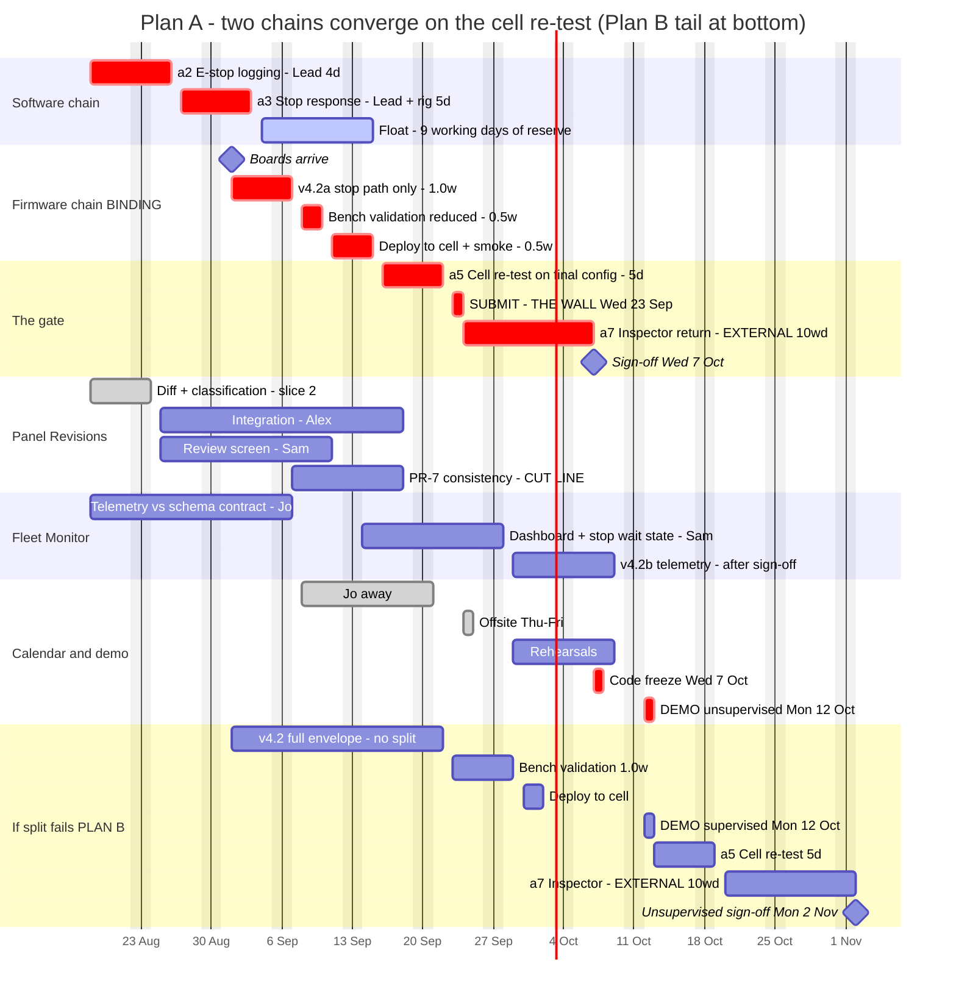

# Critical path — Plan A, with the Plan B tail

Source: [`diagrams/critical-path.mmd`](diagrams/critical-path.mmd)

GitHub renders the block below directly. To regenerate elsewhere:
`npx @mermaid-js/mermaid-cli -i deliverables/diagrams/critical-path.mmd -o critical-path.svg`

---

---

## How to read it

**Two chains, one gate.** The software chain (a2 → a3) and the firmware chain
(boards → v4.2a → bench → deploy) run independently and both feed the cell
re-test. Neither was traced end to end in the hand-over.

**The firmware chain is binding.** It clears 15 Sep; the software chain clears
3 Sep. The nine working days between them are drawn as float, and that float is
the plan's only reserve on this path. It is not spare capacity to fill.

**The wall.** `SUBMIT` sits on Wed 23 Sep. The arithmetic deadline is Fri 25 Sep
— ten working days back from Fri 9 Oct — but Thu 24 and Fri 25 are the week-6
offsite, so the last day anyone can actually submit is the Wednesday. Plan A has
**no slack** between a5 finishing and the wall.

**The offsite falls inside the inspector window.** Harmless, because a7 is
external work. It is drawn because it is the reason the wall moved.

**Plan B is not a delay.** It starts from the same boards date and differs only
in ordering: firmware runs whole instead of split, so the re-test happens after
the demo rather than before it. Both plans demo on 12 October. What moves is the
certificate — from 7 Oct to ~2 Nov.

## What this diagram does not show

- **Robotics resource contention.** One spare controller, one live cell, Chris
  at 0.8 FTE. Bench validation (8–10 Sep) and a5 (16–22 Sep) do not collide on
  these dates, but Plan B's bench (23–29 Sep) sits closer to other cell work.
  This needs a proper robotics swimlane before it can be relied on.
- **FM-4.** Cut under Plan A — the envelope ships in v4.2b, after sign-off.
  Buildable under Plan B. Its absence from Plan A's rows is the point.
- **The two-clocks contrast.** An earlier version put features and permission
  side by side as two tracks, which made the asymmetry more legible. Six sections
  cost that. If a presentation opener is wanted, a stripped four-bar version —
  features vs permission, Plan A vs Plan B — belongs in a separate frame.

## Calendar note

Weeks run Tue → Mon in 2026. The hand-over's day-names are wrong for 2026; its
dates are right. Bank holiday is Mon 31 Aug, inside week 2. Demo is Mon 12 Oct.
See the note at the top of `01-delivery-plan.md`.
