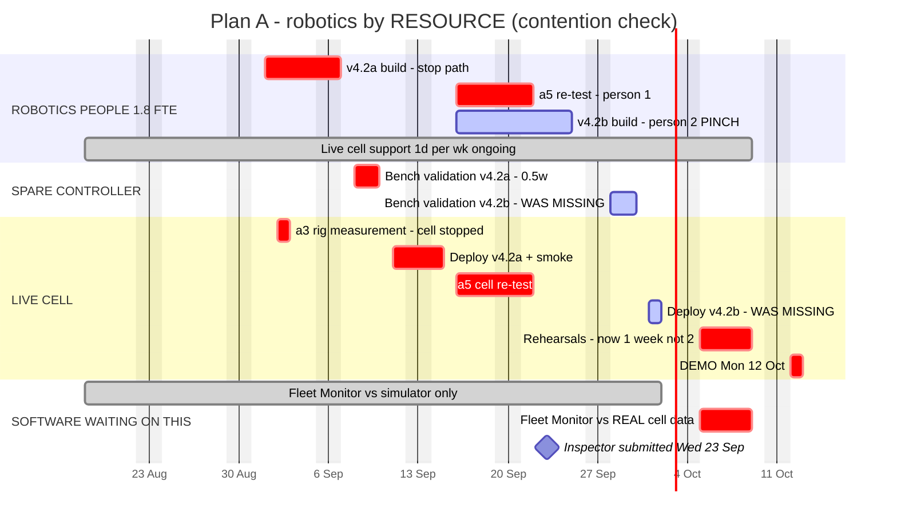

# B pass — robotics resource contention

**Owner:** Software Engineering Lead
**Purpose:** verify the claim in `01-delivery-plan.md` that robotics' constraint
is sequencing rather than capacity, by laying the work out against physical
resources instead of people.
**Result:** the claim holds on capacity. It does not hold on sequencing. Five
findings, one of which changes the recommendation in `03-demo-date-branch.md`.

---

## The constraint, read properly

Chris's plan says of bench validation: *"One spare controller, so bench and cell
work can't overlap."* That is stronger than "one bench activity at a time" — it
says bench work and **any** cell work are mutually exclusive. Three physical
resources therefore have to be scheduled, not two:

| Resource | Used by |
|---|---|
| Robotics people (1.8 FTE — Chris at 0.8) | everything |
| The spare controller | bench validation |
| The live cell | a3 rig measurement, deploys, a5 re-test, rehearsals, demo, ongoing support |

## Capacity is genuinely fine

8 weeks × 1.8 FTE = 14.4 person-weeks, minus the week-6 offsite (0.72) and
ongoing live cell support (1.6) = **~12.1 person-weeks available**. Plan A's
robotics work totals **~4.9**. There is plenty of headroom.

**Capacity was never the question.** Everything below is about ordering.

---

## Finding 1 — v4.2b had no validation or deploy in the plan

`01-delivery-plan.md` showed v4.2b as a build with no tail. But you do not deploy
unvalidated firmware to a cell: v4.2b needs its own bench validation (spare
controller) and its own deploy (live cell). That is roughly a week of resource
time that existed nowhere in the plan.

**Fix:** v4.2b builds in parallel with a5 (16–25 Sep, second person), bench
28–30 Sep, deploy 1–2 Oct. It fits — but only because it was found now.

## Finding 2 — the split starves Fleet Monitor of real data

This is the significant one.

Plan A's split puts the run-event stream in **v4.2b**, which by construction
ships *after* the inspector has signed off. So the earliest the cell emits real
events is **2 October**. Fleet Monitor's first contact with real cell data is
therefore 5–9 Oct — **one week before the demo.**

Fleet Monitor is the feature the customer is buying.

**And the backlog history is explicit about what hardware integration costs this
team:** cell status widget 2.0 → 3.2, controller telemetry v1 2.0 → 4.2, cell
state sync 2.0 → 4.2. Hardware-dependent work runs at roughly **2×**. Compressing
that integration into the last week before a customer demo is precisely where
that overrun lands.

Mitigation exists — Jo builds against a simulator derived from the schema
contract from week 1, which is why the contract is a week-1 deliverable. But a
simulator is not the cell, and the gap between them is exactly what the 2×
multiplier measures.

## Finding 3 — the rehearsal window halves

`01-delivery-plan.md` had rehearsals running 29 Sep – 9 Oct. But the live cell is
occupied by v4.2b's deploy until 2 Oct, so rehearsals actually start **5 Oct**.
Two weeks becomes one, on a demo that must run unsupervised in front of a
customer.

Worse, it is the same week as Fleet Monitor's first real-data integration
(Finding 2). Rehearsal and integration are competing for the same five days and
the same cell.

## Finding 4 — a people pinch, 16–25 Sep

Running a5 and the v4.2b build in parallel needs 1.0 + 1.5 = **2.5 person-weeks**
in 1.5 calendar weeks. Available: 1.8 FTE × 1.5 = 2.7, minus live cell support
0.3 = **2.4**. Marginally over, at 100%+ utilisation, in the window that decides
whether the inspector submission makes the wall.

It also assumes the two robotics people are interchangeable enough to split
across a safety re-test and a firmware build simultaneously. Chris is at 0.8 and
on the commissioning site one day a week. **Worth asking rather than assuming.**

## Finding 5 — Plan A's robotics chain has one day of float

From boards landing (Tue 1 Sep) to a5 complete (Tue 22 Sep) is 16 working days.
The sequential work — v4.2a 1.0w + bench 0.5w + deploy 0.5w + a5 1.0w — is
**15 working days**.

**One working day of float, or about 6%.** Serial work, so extra people do not
help. Any overrun above 6% on any link pushes the submission past the wall.

For context, the smallest overrun anywhere in the backlog history is 13%.

---

## What this does to the recommendation

`03-demo-date-branch.md` framed the choice as: Plan A buys the date and pays with
FM-4; Plan B buys capability and slack and pays a supervised demo.

**That framing was incomplete.** Plan A also pays with Fleet Monitor's
integration time. Stated honestly:

| | Plan A | Plan B |
|---|---|---|
| Demo runs unsupervised | Yes | No |
| Fleet Monitor real-cell integration | **1 week** | 3+ weeks |
| Rehearsal window | 1 week | 2 weeks |
| Robotics chain float | ~1 day | ~2 weeks |
| FM-4 | Cut | Ships |

So Plan A delivers an **unsupervised demo of under-integrated software**, and the
under-integrated part is the feature the customer came to see. That combination
is worse than either risk alone: unsupervised means nobody is standing there when
it fails.

**Revised recommendation.** Plan B, unless Chris says the split is clean *and*
that run events can ship in v4.2a without extending the build. That second
condition was not in the original question and it should be — it is what
determines whether Plan A's Fleet Monitor is demo-ready or merely present.

**The question to Chris becomes two questions:**

1. Can v4.2 split so the stop path ships first and observability ships after?
2. Can the **run-event stream** ride in the early half without extending it?

If both are yes, Plan A is genuinely good. If (1) is yes and (2) is no, Plan A
gets the certificate and risks the demo. If (1) is no, it is Plan B regardless.

---

## What still is not verified

- Whether the two robotics people can actually work independently across a
  safety re-test and a firmware build (Finding 4).
- Whether rehearsals genuinely need the cell for a full week, or whether parts
  can run against recorded events.
- Whether v4.2b's bench validation can be shortened, given it is observability
  only and touches no control path.

---

## The diagram

Source: [`diagrams/robotics-contention.mmd`](diagrams/robotics-contention.mmd).
Laid out by **resource** rather than by person — contention is only visible that
way. Bars marked `WAS MISSING` are the work this pass found.

